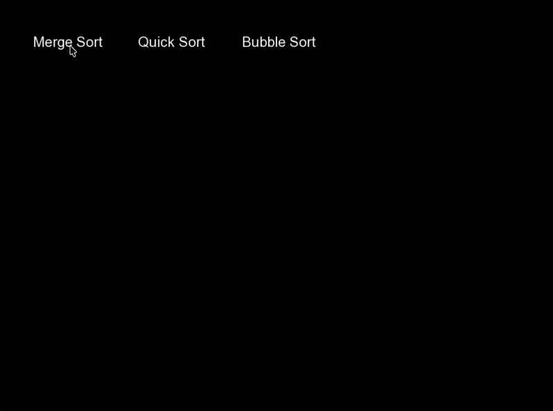

# Sorting Animation

An interactive C++ application that provides real-time visual demonstrations of popular sorting algorithms using the SFML graphics library. Watch how different sorting algorithms work step-by-step with animated bar charts.

# Here's a demo of Merge Sort



## Features

- **Real-time Visual Sorting**: Watch sorting algorithms in action with smooth animations
- **Multiple Algorithms**: Interactive demonstrations of:
  - **Merge Sort** - Divide and conquer approach (O(n log n))
  - **Quick Sort** - Efficient partitioning algorithm (O(n log n) average)
  - **Bubble Sort** - Simple comparison-based sort (O(n²))
- **Interactive Interface**: Clean UI with clickable buttons for algorithm selection
- **Random Data Generation**: Automatically generates unique random arrays for each session
- **Visual Feedback**: Post-sort highlighting to show completion
- **Educational Value**: Perfect for understanding algorithm behavior and complexity

## Screenshots

| Main Interface | Sorting in Progress | Completed Sort |
|:-------------:|:------------------:|:-------------:|
|  |  |  |
<!-- Add actual screenshots when available -->

## Quick Start

### Prerequisites

- **C++17** compatible compiler (GCC, Clang, or MSVC)
- **CMake 3.26** or higher
- **SFML 2.5+** graphics library

### Installation

#### macOS (using Homebrew)
```bash
# Install SFML
brew install sfml

# Clone the repository
git clone https://github.com/lawrenceDegoma/SortingAnimation.git
cd SortingAnimation

# Build the project
mkdir build && cd build
cmake ..
make

# Run the application
./SortAnimation
```

#### Ubuntu/Debian
```bash
# Install SFML
sudo apt-get install libsfml-dev

# Clone and build
git clone https://github.com/lawrenceDegoma/SortingAnimation.git
cd SortingAnimation
mkdir build && cd build
cmake ..
make
./SortAnimation
```

#### Windows (Visual Studio)
```bash
# Install SFML through vcpkg or download from https://www.sfml-dev.org/
# Then build with CMake or Visual Studio
```

## How to Use

1. **Launch the application** - A window will open showing an array of random bars
2. **Select an algorithm** - Click one of the three buttons:
   - "Merge Sort" - Watch the divide-and-conquer approach
   - "Quick Sort" - See efficient partitioning in action
   - "Bubble Sort" - Observe the simple comparison method
3. **Watch the animation** - Bars will move and rearrange in real-time
4. **Completion highlight** - The sorted array will be highlighted when done
5. **Try again** - A new random array is automatically generated for the next sort

## Project Structure

```
SortingAnimation/
├── main.cpp           # Application entry point and event handling
├── Sorting.h/cpp      # Implementation of sorting algorithms
├── Renderer.h/cpp     # Graphics rendering and visualization
├── Button.h/cpp       # UI button functionality
├── Utility.h/cpp      # Helper functions (array generation, etc.)
├── CMakeLists.txt     # Build configuration
├── arial.ttf          # Font file for UI text
└── README.md          # This file
```

## Technical Details

- **Language**: C++17
- **Graphics**: SFML (Simple and Fast Multimedia Library)
- **Build System**: CMake
- **Array Size**: 600 elements
- **Window Size**: 800x600 pixels
- **Architecture**: Modular OOP design with clear separation of concerns

### Algorithm Implementations

- **Merge Sort**: Recursive divide-and-conquer with visual merging steps
- **Quick Sort**: In-place partitioning with pivot visualization
- **Bubble Sort**: Adjacent element swapping with immediate visual feedback

## Demo

The GIF above shows the Merge Sort algorithm in action, demonstrating how the bars are highlighted in red as elements are being sorted, while all other elements remain white.

## Recording Your Own Demo

To record and embed your own video demonstrations:

### Option 1: GIF (Used above)
1. **Record your screen** using tools like:
   - macOS: QuickTime Player, Screenshot app (Cmd+Shift+5)
   - Windows: Xbox Game Bar (Win+G), OBS Studio
   - Linux: OBS Studio, SimpleScreenRecorder

2. **Convert to GIF**:
   ```bash
   # Generate palette
   ffmpeg -i your_recording.mov -vf "fps=10,scale=800:-1:flags=lanczos,palettegen" palette.png
   
   # Create GIF
   ffmpeg -i your_recording.mov -i palette.png -filter_complex "fps=10,scale=800:-1:flags=lanczos[x];[x][1:v]paletteuse" demo.gif
   ```

3. **Add to README**:
   ```markdown
   
   ```

## Contributing

Contributions are welcome! Here are some ideas for improvements:

- [ ] Add more sorting algorithms (Heap Sort, Radix Sort, etc.)
- [ ] Implement speed controls (slow/normal/fast)
- [ ] Add sound effects for swaps/comparisons
- [ ] Include algorithm complexity information in UI
- [ ] Add step-by-step mode with pause/resume
- [ ] Implement different array patterns (sorted, reverse-sorted, etc.)

## 🙏 Acknowledgments

- **SFML Community** - For the excellent graphics library
- **Algorithm Visualization** - Inspired by educational sorting demonstrations
- **Open Source Community** - For tools and libraries that make projects like this possible

## 📧 Contact

**Lawrence Degoma**
- GitHub: [@lawrenceDegoma](https://github.com/lawrenceDegoma)
- Project Link: [https://github.com/lawrenceDegoma/SortingAnimation](https://github.com/lawrenceDegoma/SortingAnimation)

---

